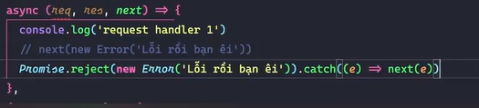
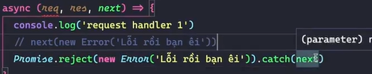

# Dùng checkSchema để valide body register = thư viện express validator

đọc docs => `schema validation` của thư viện nhìn nó trực quan và dễ nhìn hơn

viết 1 cái middleware trong `user.middleware`

```ts
import { NextFunction, Request, Response } from 'express'
import { checkSchema } from 'express-validator'
export const loginValidator = (req: Request, res: Response, next: NextFunction) => {
  const { email, password } = req.body
  if (!email || !password) {
    return res.status(400).json({
      message: 'Email and password are required',
    })
  }
  next()
}
export const registerValidator = checkSchema({
  name: {
    notEmpty: true,
    isString: true,
    isLength: {
      options: { min: 1, max: 100 },
    },
    trim: true,
  },
  email: {
    notEmpty: true,
    isEmail: true,
    trim: true,
  },
  password: {
    notEmpty: true,
    isString: true,
    isLength: {
      options: { min: 6, max: 100 },
    },
    isStrongPassword: {
      options: { minLength: 6, minLowercase: 1, minUppercase: 1, minNumbers: 1, minSymbols: 1 },
    },
  },
  confirm_password: {
    notEmpty: true,
    isString: true,
    isLength: {
      options: { min: 6, max: 100 },
    },
    isStrongPassword: {
      options: { minLength: 6, minLowercase: 1, minUppercase: 1, minNumbers: 1, minSymbols: 1 },
    },
  },
  date_of_birth: {
    isISO8601: {
      options: {
        strict: true,
        strictSeparator: true,
      },
    },
  },
})
```

sử dụng ben cái `user.routes.ts`

```ts
usersRouter.post('/register', registerValidator, registerController)
```

vẫn chưa xuất ra lỗi cho mình => đọc docs `manually running validations`

docs `https://express-validator.github.io/docs/guides/manually-running#example-creating-own-validation-runner`

=> validate check cái lỗi trong `registerValidator` => ko cho chạy đến controller nữa

tạo 1 file `utils/validation.ts`

```ts
import express from 'express'
import { body, validationResult, ContextRunner, ValidationChain } from 'express-validator'
import { RunnableValidationChains } from 'express-validator/lib/middlewares/schema'

// cái kiểu của validations lấy ở đâu
// ấn vào cái checkSchema bên cái user.middleware để lấy kiểu dữ liệu
export const validate = (validations: RunnableValidationChains<ValidationChain>) => {
  return async (req: express.Request, res: express.Response, next: express.NextFunction) => {
    await validations.run(req) // check lỗi
    const errors = validationResult(req)
    if (!errors.isEmpty()) {
      return res.status(400).json({ errors: errors.mapped() })
    }
    next()
  }
}
```

khi đó sử dụng bên cái `user.middleware`

```ts
export const registerValidator = validate(
  checkSchema({
    name: {
      notEmpty: {
        errorMessage: 'Name is required',
        bail: true,
      },
      isString: true,
      isLength: {
        options: { min: 1, max: 100 },
        errorMessage: 'Name must be between 1 and 100 characters',
      },
      trim: true,
    },
    email: {
      notEmpty: {
        errorMessage: 'Email is required',
        bail: true,
      },
      isEmail: {
        errorMessage: 'Email is not valid',
      },
      trim: true,
    },
    password: {
      notEmpty: true,
      isString: true,
      isLength: {
        options: { min: 6, max: 100 },
        errorMessage: 'Password must be between 6 and 100 characters',
      },
      isStrongPassword: {
        options: { minLength: 6, minLowercase: 1, minUppercase: 1, minNumbers: 1, minSymbols: 1 },
      },
      errorMessage:
        'Password must be at least 6 characters long and contain at least 1 lowercase letter, 1 uppercase letter, 1 number, and 1 symbol',
    },
    confirm_password: {
      notEmpty: true,
      isString: true,
      isLength: {
        options: { min: 6, max: 100 },
        errorMessage: 'Password must be between 6 and 100 characters',
      },
      isStrongPassword: {
        options: { minLength: 6, minLowercase: 1, minUppercase: 1, minNumbers: 1, minSymbols: 1 },
      },
      errorMessage:
        'Password must be at least 6 characters long and contain at least 1 lowercase letter, 1 uppercase letter, 1 number, and 1 symbol',
      custom: {
        options: (value, { req }) => {
          if (value !== req.body.password) {
            throw new Error('Password confirm does not match password')
          }
          return true
        },
      },
    },
    date_of_birth: {
      isISO8601: {
        options: {
          strict: true,
          strictSeparator: true,
        },
      },
    },
  }),
)
```

khi đó call api register mà có lỗi (ví dụ như trong body ko truyền lên cái gì) thì trả ra như sau

```json
{
  "errors": {
    "date_of_birth": {
      "type": "field",
      "msg": "Invalid value",
      "path": "date_of_birth",
      "location": "body"
    },
    "email": {
      "type": "field",
      "msg": "Invalid value",
      "path": "email",
      "location": "body"
    },
    "name": {
      "type": "field",
      "msg": "Invalid value",
      "path": "name",
      "location": "body"
    },
    "password": {
      "type": "field",
      "msg": "Invalid value",
      "path": "password",
      "location": "body"
    },
    "confirm_password": {
      "type": "field",
      "msg": "Invalid value",
      "path": "confirm_password",
      "location": "body"
    }
  }
}
```

# Kiểm tra email có tồn tại hay ko

thêm cái custom trong cái validator email của registor

```ts
email: {
      notEmpty: {
        errorMessage: 'Email is required',
        bail: true,
      },
      isEmail: {
        errorMessage: 'Email is not valid',
      },
      trim: true,
      custom: {
        options: async (value) => {
          const res = await userSevice.checkEmailExist(value)
          if (res) {
            return Promise.reject('Email already exists')
          }
          return true
        },
      },
    },
```

hàm `userSevice.checkEmailExist(value)`

```ts
async checkEmailExist(email: string) {
    const user = await databaseService.users.findOne({ email })
    return Boolean(user)
  }
```

# Tạo Access Token và Refresh Token

tạo `models/requests/User.request.ts` để định nghĩa inteface body gửi lên

```ts
export interface RegisterReqBody {
  name: string
  email: string
  password: string
  confirm_password: string
  date_of_birth: string
}
```

sang `user.controller.ts`

```ts
// hover vào cái req => copy kiểu dữ liệu của nó
// cái any đầu tiên là cái req. gì đó
// tìm đến cái req.body để định kiểu dữ liệu cho nó ()
export const registerController = async (req: Request<ParamsDictionary, any, RegisterReqBody>, res: Response) => {
  // const { email, password, confirm_password, date_of_birth, name } = req.body
  try {
    const result = await userSevice.register(req.body)
    return res.json({
      message: 'Register success',
      result,
    })
  } catch (error) {
    return res.status(400).json({
      message: 'Register Failed',
      error,
    })
  }
}
```

sang cái `user.services.ts`

```ts
import { RegisterReqBody } from '~/models/requests/User.request'
import User from '~/models/schemas/User.schema'
import databaseService from '~/services/database.service'

class UsersService {
  async register(payload: RegisterReqBody) {
    const result = await databaseService.users.insertOne(
      new User({
        ...payload,
        date_of_birth: new Date(payload.date_of_birth), // convert từ isoString sang date
      }),
    )
    return result
  }
  async checkEmailExist(email: string) {
    const user = await databaseService.users.findOne({ email })
    return Boolean(user)
  }
}
const userSevice = new UsersService()
export default userSevice
```

## hash password

tạo `utils/crypto.ts`

```ts
import { createHash } from 'crypto'

function sha256(content: string) {
  return createHash('sha256').update(content).digest('hex')
}
export const hashPassword = (pass: string) => {
  return sha256(pass + process.env.PASSWORD_SERCET)
}
```

sử dụng trong `user.services`

```ts
async register(payload: RegisterReqBody) {
    const result = await databaseService.users.insertOne(
      new User({
        ...payload,
        password: hashPassword(payload.password),
        date_of_birth: new Date(payload.date_of_birth), // convert từ isoString sang date
      }),
    )
    return result
  }
```

## tạo token

`npm i jsonwebtoken`

viết `utils/jwt.ts`

```ts
import jwt from 'jsonwebtoken'

export const signToken = ({
  payload,
  privateKey = process.env.JWT_SERCET as string, // chuỗi bất kì
  options = {
    expiresIn: '1d',
    algorithm: 'HS256',
  },
}: {
  payload: string | object | Buffer
  privateKey?: string
  options?: jwt.SignOptions
}) => {
  return new Promise<string>((resolve, reject) => {
    jwt.sign(payload, privateKey, options, (error, token) => {
      if (error) throw reject(error)
      resolve(token as string)
    })
  })
}
```

sử dụng trong `user.services.ts`

```ts
import { TokenType } from '~/constants/enums'
import { RegisterReqBody } from '~/models/requests/User.request'
import User from '~/models/schemas/User.schema'
import databaseService from '~/services/database.service'
import { hashPassword } from '~/utils/crypto'
import { signToken } from '~/utils/jwt'

class UsersService {
  private signAccessToken(userId: string) {
    return signToken({
      payload: {
        userId,
        token_type: TokenType.AccessToken,
      },
    })
  }
  private signRefreshToken(userId: string) {
    return signToken({
      payload: {
        userId,
        token_type: TokenType.RefreshToken,
      },
    })
  }
  async register(payload: RegisterReqBody) {
    const result = await databaseService.users.insertOne(
      new User({
        ...payload,
        password: hashPassword(payload.password),
        date_of_birth: new Date(payload.date_of_birth), // convert từ isoString sang date
      }),
    )
    const userId = result.insertedId.toString()
    const [access_token, refresh_token] = await Promise.all([
      this.signAccessToken(userId),
      this.signRefreshToken(userId),
    ])

    return {
      access_token,
      refresh_token,
    }
  }
  async checkEmailExist(email: string) {
    const user = await databaseService.users.findOne({ email })
    return Boolean(user)
  }
}
const userSevice = new UsersService()
export default userSevice
```

# Bài 85: Error Handle trong Express.js (lí thuyết)

có 2 loại handler

## request handle

nhận request từ client và trả về response (ví dụ như cái controller của mình)

là 1 func nhận 3 tham số (req,res,next)

nếu ko dùng next thì ko cần khai báo cũng được

ví dụ

```ts
app.use('/users', (req, res, next) => {
  res.send('hello world')
})
```

1. gọi `next()` ko có tham số => chuyển sang cái request handle tiếp theo

```ts
usersRouter.post('/register', registerValidator, registerController)
```

thì chạy xong cái `reVal` sẽ chạy đến cái `resController`

nếu ko có next thì nó sẽ dừng mãi ở cái request handle đó

2. nếu có tham số `next(err)` => chuyển sang `error handle`

## error handle

nhận error từ reqest handle và trả về response

là 1 fun nhận vào 4 tham số (bắt buộc) là err, req,res,next

```ts
app.use((err, req, res, next) => {
  if (err) {
    //do
    res.status(400).send('Error')
  }
})
```

ví dụ

```ts
...(req,res,next) => { (1)
  // throw new Error(loi) cũng như cái dưới
  next(new Error("loi")) // nó sẽ bỏ qua các cái request handle dưới chạy thẳng xuống cái error handle
},
// .... có nhiều cái request handle nữa
(err,req,res,next) => {
  res.status(400).send('Error')
}
```

nếu trong cái (1) nó sẽ async function => throw ko ăn nữa => đưa cái lỗi vào try catch rồi next nó

```ts
aysnc(req,res,next) => {
  try{
    throe new Error('ss')
  }catch(err){
    next(err)
  }
}
```



hoặc là



# Bài 86: Tạo wrapRequestHandler để xử lý lỗi

vấn đề: thấy cái phần xử lí lỗi lúc nào cũng res.status... => quy về 1 cái next() thôi

ví dụ

```ts
export const registerController = async (
  req: Request<ParamsDictionary, any, RegisterReqBody>,
  res: Response,
  next: NextFunction,
) => {
  try {
    const result = await userSevice.register(req.body)
    return res.json({
      message: 'Register success',
      result,
    })
  } catch (error) {
    //phần này này
    // return res.status(400).json({
    //   message: 'Register Failed',
    //   error,
    // })

    next(error) // => thế này thôi
  }
}
```

bên `user.route.ts`

```ts
usersRouter.post('/register', registerValidator, registerController, (err, req, res, next) => {
  console.log(err)
  res.status(400).json({ error: err.message })
})
```

vẫn ch tối ưu

=> tập trung cho cả app => khai báo middleware bên `index.ts` (file to nhất)

```ts
import express, { NextFunction, Request, Response } from 'express'
import usersRouter from '~/routes/users.routes'
import databaseService from '~/services/database.service'
const app = express()
const port = 3000
app.use(express.json()) // là 1 cái middleware cái ex.json sẽ đưa cái json truyền lên ở body thành 1 cái obj
app.use('/users', usersRouter)
databaseService.connect()
app.use((err: any, req: Request, res: Response, next: NextFunction) => {
  console.log(err)
  res.status(404).json({ error: err.message })
})
app.listen(port, () => {
  console.log(`app is running in port ${port}`)
})
```

tiếp tục tối ưu: chả nhẽ cái controller nào cũng try catch

tạo 1 function bọc lại cái controller này

tạo `utlis/handles.ts`

```ts
import { NextFunction, Request, RequestHandler, Response } from 'express'
// type Func = (req: Request, res: Response, next: NextFunction) => Promise<void>
export const wrapRequestHandler = (func: RequestHandler) => {
  // cái func chính là cái controller này
  return async (req: Request, res: Response, next: NextFunction) => {
    try {
      await func(req, res, next)
    } catch (error) {
      next(error)
    }
  }
}
```

khi sử dụng thì muốn dùng như sau

```ts
usersRouter.post('/register', registerValidator, wrapRequestHandler(registerController))
```

và bên cái `registerController` k cần cái try catch nữa

```ts
export const registerController = async (
  req: Request<ParamsDictionary, any, RegisterReqBody>,
  res: Response,
  next: NextFunction,
) => {
  const result = await userSevice.register(req.body)
  return res.json({
    message: 'Register success',
    result,
  })
}
```

# Bài 87: Chuẩn hóa bộ xử lý lỗi

bên cái middleware có cá trường hợp cho ra lỗi 422(validate) có 1 vai trường hợp ko phải 422

ví dụ như ko có token => 401

làm sao để phân biệt đưuọc trả về 401, lúc nào trả về 422

thường thì 422 là lỗi validation => chủ động trả về ở lúc custom cái validation tại file `validation.ts`

```ts
import express from 'express'
import { body, validationResult, ContextRunner, ValidationChain } from 'express-validator'
import { RunnableValidationChains } from 'express-validator/lib/middlewares/schema'

// cái kiểu của validations lấy ở đâu
// ấn vào cái checkSchema bên cái user.middleware để lấy kiểu dữ liệu
export const validate = (validations: RunnableValidationChains<ValidationChain>) => {
  return async (req: express.Request, res: express.Response, next: express.NextFunction) => {
    await validations.run(req) // check lỗi
    const errors = validationResult(req)
    if (!errors.isEmpty()) {
      return res.status(422).json({ errors: errors.mapped() }) // tại đây
    }
    next()
  }
}
```

như trên thì lúc mà chạy cái `user.middleware` (lúc mà check schema validate dữ liệu ) => nếu có lỗi lúc nào cũng trả ra 422

`ví dụ như muốn khi tìm ko ra email => trả về lỗi 401 thì sao`

bên hàm `validation.ts` => log cái error ra

```ts
export const validate = (validations: RunnableValidationChains<ValidationChain>) => {
  return async (req: express.Request, res: express.Response, next: express.NextFunction) => {
    await validations.run(req) // check lỗi
    const errors = validationResult(req)
    const errorsObject = errors.mapped()
    console.log('🚀 ~ return ~ errorsObject:', errorsObject)
    if (!errors.isEmpty()) {
      return res.status(422).json({ errors: errors.mapped() })
    }
    next()
  }
}
```

nếu mà đăng kí email đã tồn tại thì log ra được cái này

```ts
{
    "errors": {
        "email": {
            "type": "field",
            "value": "manhtranduc0202@gmail.com",
            "msg": "Email already exists",
            "path": "email",
            "location": "body"
        }
    }
}
```

do cái bên `checkSchema` bên cái `user.middleware` trả về tại cái custom của lúc validate email

```ts
email: {
      notEmpty: {
        errorMessage: 'Email is required',
        bail: true,
      },
      isEmail: {
        errorMessage: 'Email is not valid',
      },
      trim: true,
      custom: {
        options: async (value) => {
          const res = await userSevice.checkEmailExist(value)
          if (res) {
            // return Promise.reject('Email already exists')
            throw {message:'Email already exists',status:401}// khi đó cái msg ở cái log errors nó sẽ là cái object kia
          }
          return true
        },
      },
    },
```

=> lặp qua cái mảng errors kia nếu mà cái message nào có cái status !== 422 thì mình cho trả về cái error như cái định dạng obj, còn bình thường thì trả về 422 như thường

## quy định format lỗi

1. lỗi thông thường thì trả về

```ts
  {
    message:string
    error_info?: any
  }
```

2. lỗi validation(422)

```ts
  {
    message:string,
    errors:{
      [field:string] : {
        msg: string
        [key:string]:any
      }
    }
  }
```

## Cài đặt

1. tạo 1 cái class bên `models/Errors.ts`

```ts
export class ErrorWithStatus {
  message: string
  status: number
  constructor({ message, status }: { message: string; status: number }) {
    this.message = message
    this.status = status
  }
}
```

2. qua bên `user.middleware.ts` sử dụng như sau

```ts
email: {
      notEmpty: {
        errorMessage: 'Email is required',
        bail: true,
      },
      isEmail: {
        errorMessage: 'Email is not valid',
      },
      trim: true,
      custom: {
        options: async (value) => {
          const res = await userSevice.checkEmailExist(value)
          if (res) {
            // return Promise.reject('Email already exists')
            throw new ErrorWithStatus({
              message: 'Email already exists',
              status: 400,
            })
          }
          return true
        },
      },
    },
```

nếu mà trên cái class `ErrorWithStatus` có `extend class Error` mặc định thì cái lỗi trả về của `user.middleware.ts` nó chỉ nhận được cái message là `Email already exists` thôi chứ ko có trả về cái status nữa => ko hay => ko dùng cái `extend class Error` đấy nữa

(do cái express validator => chứ thực tế là dùng hay hơn là ko dùng)

khi đó trả ra lỗi nó sẽ như sau

```ts
{
    "errors": {
        "email": {
            "type": "field",
            "value": "manhtranduc0202@gmail.com",
            "msg": {
                "message": "Email already exists",
                "status": 400
            },
            "path": "email",
            "location": "body"
        }
    }
}
```

sang bên cái `validation.ts` để lặp qua các cái lỗi để lấy ra các lỗi có status đặc biệt mà muốn custom

tạm thời để đó đã => tạo 1 cái constants để lưu các status http

tạo `constants/HTTP_STATUS.ts`

```ts
const HTTP_STATUS = {
  OK: 200,
  CREATED: 201,
  UNPROCESSABLE_ENTITY: 422,
  UNAUTHORIZED: 401,
  NOT_FOUND: 404,
  INTERNAL_SERVER_ERROR: 500,
}
export default HTTP_STATUS
```

lưu ý ko trả về errors trong cái validation này dồn cai eror vào trong cái middleware sử dụng bên index.ts(file to nhất) => là cái error default

```ts
app.use((err: any, req: Request, res: Response, next: NextFunction) => {
  res.status(400).json({ error: err.message })
})
```

viết hàm bên `validation.ts`

```ts
import express from 'express'
import { body, validationResult, ContextRunner, ValidationChain } from 'express-validator'
import { RunnableValidationChains } from 'express-validator/lib/middlewares/schema'
import HTTP_STATUS from '~/constants/HTTP_STATUS'
import { ErrorWithStatus } from '~/models/Errors'

// cái kiểu của validations lấy ở đâu
// ấn vào cái checkSchema bên cái user.middleware để lấy kiểu dữ liệu
export const validate = (validations: RunnableValidationChains<ValidationChain>) => {
  return async (req: express.Request, res: express.Response, next: express.NextFunction) => {
    await validations.run(req) // check lỗi
    const errors = validationResult(req)
    const errorsObject = errors.mapped()
    for (const key in errorsObject) {
      const { msg } = errorsObject[key]
      // dòng dưới có nghĩa là msg có kiểu là ErrorWithStatus và có status !== 422
      if (msg instanceof ErrorWithStatus && msg.status !== HTTP_STATUS.UNPROCESSABLE_ENTITY) {
        return next(msg)
      }
    }
    if (!errors.isEmpty()) {
      return res.status(422).json({ errors: errors.mapped() })
    }
    next()
  }
}
```

khi dó cái lỗi `Email already exists` có mã lỗi là bao nhiêu cũng được miễn là nó khác 422 (ví dụ trên cái checkSchema ở `user.middleware.ts`) thì nó chỉ trả ra cái này

```ts
{
    "error": "Email already exists"
}
// đồng thời trên đó sẽ trả ra lỗi (ở trên cái thnah thông báo chứ ko hiện lên cái trả về)  là 400 Bad Request do cái mặc định tại cái index.ts đã nói ở trên
```

luồng chạy

request vào user.router => user.register => chạy đến cái validation => lỗi tại cái validate => chạy cái `next(msg)` => chay đến cái `middleware` xử lí lỗi bên `index.js`

thấy lúc nào nó cũng trả ra lỗi là 400 thì ko hay (bên cái middleware của index)

=> tách cái đó ra thành 1 file `middlewares/errorMiddleware.ts`

```ts
import { NextFunction, Request, Response } from 'express'
import { omit } from 'lodash'
import HTTP_STATUS from '~/constants/HTTP_STATUS'

export const defaultErrorHandler = (err: any, req: Request, res: Response, next: NextFunction) => {
  // cần trả về đúng định dạng lỗi
  res.status(err.status || HTTP_STATUS.INTERNAL_SERVER_ERROR).json(omit(err, ['status'])) // bỏ cái status đi (do http auto tự trả về rồi)
}
```

sử dụng bên `index.ts`

```ts
app.use(defaultErrorHandler)
```

như vậy là cái email lúc validate bên user.middleware nó sẽ trả ra lỗi bao nhiêu thì cái index nó sẽ trả ra default là như thế(do chạy vào `next(msg)`)

đã xử lí xong case khác 422

vậy còn 422 thì sao

tạo thêm 1 cái class eror nữa bên file `Errors.ts`

```ts
// dành cho 422
// type ErrorsType = Record<string, string> // sẽ có dạng {[key:string] : string}
// cái obj phía sau phụ thuộc vào cái mà lỗi trả về (ví dụ đang dùng validator của express nó trả ra thế kia)
type ErrorsType = Record<
  string,
  {
    msg: string
    [key: string]: any
  }
>
export class EntityError extends ErrorWithStatus {
  errors: ErrorsType
  constructor({ message = USER_MESSAGES.VALIDATION_ERROR, errors }: { message: string; errors: ErrorsType }) {
    // status luôn là 422
    super({ message, status: HTTP_STATUS.UNPROCESSABLE_ENTITY })
    this.errors = errors
  }
}
```

xử lí lỗi 422 bên file `validation.ts`

```ts
import express from 'express'
import { body, validationResult, ContextRunner, ValidationChain } from 'express-validator'
import { RunnableValidationChains } from 'express-validator/lib/middlewares/schema'
import HTTP_STATUS from '~/constants/httpStatus'

import { EntityError, ErrorWithStatus } from '~/models/Errors'

// cái kiểu của validations lấy ở đâu
// ấn vào cái checkSchema bên cái user.middleware để lấy kiểu dữ liệu
export const validate = (validations: RunnableValidationChains<ValidationChain>) => {
  return async (req: express.Request, res: express.Response, next: express.NextFunction) => {
    await validations.run(req) // check lỗi
    const errors = validationResult(req)
    //ko có lỗi => chạy tiếp luôn
    if (errors.isEmpty()) {
      return next()
    }
    // có lỗi
    const errorsObject = errors.mapped()
    const entityError = new EntityError({
      errors: {},
    })
    // lặp qua lỗi
    for (const key in errorsObject) {
      const { msg } = errorsObject[key]
      // dòng dưới có nghĩa là msg có kiểu là ErrorWithStatus và có status !== 422 (thường là lỗi ko phải do validate)
      if (msg instanceof ErrorWithStatus && msg.status !== HTTP_STATUS.UNPROCESSABLE_ENTITY) {
        return next(msg)
      }
      //thường là lỗi validate
      // lỗi 422 rơi vào đây => add nó vào mảng entityError
      entityError.errors[key] = errorsObject[key]
    }

    next(entityError)
  }
}
```

khi đó send request sẽ trả về

```ts
{
  //lỗi 422
    "message": "Validation error",
    "errors": {
        "confirm_password": {
            "type": "field",
            "value": "Manhkoiii123",
            "msg": "Password must be at least 6 characters long and contain at least 1 lowercase letter, 1 uppercase letter, 1 number, and 1 symbol",
            "path": "confirm_password",
            "location": "body"
        },
        "email": {
            "type": "field",
            "value": "manhtranduc0202@gmail.com",
            "msg": "Email already exists",
            "path": "email",
            "location": "body"
        }
    }
}
```

tối ưu lại file `errorMiddleware.ts` để có thể hiển thị các lỗi khác nữa

```ts
import { NextFunction, Request, Response } from 'express'
import { omit } from 'lodash'
import HTTP_STATUS from '~/constants/httpStatus'
import { ErrorWithStatus } from '~/models/Errors'

export const defaultErrorHandler = (err: any, req: Request, res: Response, next: NextFunction) => {
  // cần trả về đúng định dạng lỗi
  if (err instanceof ErrorWithStatus) {
    return res.status(err.status).json(omit(err, ['status']))
  }
  //chuyển enumrable của info thành true để có thể lấy ra được
  Object.getOwnPropertyNames(err).forEach((key) => {
    Object.defineProperty(err, key, {
      enumerable: true,
    })
  })
  res.status(HTTP_STATUS.INTERNAL_SERVER_ERROR).json({
    message: err.message,
    errorInfo: omit(err, ['stack']),
  })
}
```

# Xử lý logic login

vào `user.middleware.ts` để validate

```ts
export const loginValidator = validate(
  checkSchema({
    email: {
      notEmpty: {
        errorMessage: 'Email is required',
        bail: true,
      },
      isEmail: {
        errorMessage: 'Email is not valid',
      },
      trim: true,
      custom: {
        options: async (value, { req }) => {
          const user = await databaseService.users.findOne({ email: value })
          if (user === null) {
            throw new Error('Email or password wrong')
          }
          //truyền user từ bên này sang bên controller
          req.user = user
          return true
        },
      },
    },
    password: {
      notEmpty: true,
      isString: true,
      isLength: {
        options: { min: 6, max: 100 },
        errorMessage: 'Password must be between 6 and 100 characters',
      },
      isStrongPassword: {
        options: { minLength: 6, minLowercase: 1, minUppercase: 1, minNumbers: 1, minSymbols: 1 },
      },
      errorMessage:
        'Password must be at least 6 characters long and contain at least 1 lowercase letter, 1 uppercase letter, 1 number, and 1 symbol',
    },
  }),
)
```

sang `user.controller.ts` để handle

login thì phải tạo accToken và ref token => cần userId thì lấy id từ đâu ra

query đến db => dựa vào emial để lấy userId (do email là duy nhất)

lại phải check tồn tại 1 lần nữa nên trên code validator sẽ dùng 1 cái req để gắn cái user vào req để đỡ phải tìm lại bên services và bên controller (đã có code ở trên phần validator)

`user.controller.ts`

```ts
export const loginController = async (req: Request, res: Response) => {
  const { user }: any = req
  const { _id } = user
  const ans = await userSevice.login(_id.toString())
  return res.json({
    message: 'login success',
    ans,
  })
}
```

`user.service.ts`

```ts
private signAccessTokenAndRefreshToken(userId: string) {
    return Promise.all([this.signAccessToken(userId), this.signRefreshToken(userId)])
  }
async login(userId: string) {
    const [access_token, refresh_token] = await this.signAccessTokenAndRefreshToken(userId)
    return {
      access_token,
      refresh_token,
    }
  }
```

khai báo type cho cái user ở trên (còn any)
sang bên file `type.d.ts` để định type mở lên cái type lên cái req

```ts
import { Request } from 'express'
import User from '~/models/schemas/User.schema'
declare module 'express' {
  interface Request {
    user?: User
  }
}
```

khi đó file controller sửa thành

```ts
export const loginController = async (req: Request, res: Response) => {
  const user = req.user as User
  const { _id } = user
  const ans = await userSevice.login(_id.toString())
  return res.json({
    message: 'login success',
    ans,
  })
}
```

check password ngay trong cái validator lúc mà check email luôn được => ok

`user.middleware.ts`

```ts
export const loginValidator = validate(
  checkSchema({
    email: {
      notEmpty: {
        errorMessage: 'Email is required',
        bail: true,
      },
      isEmail: {
        errorMessage: 'Email is not valid',
      },
      trim: true,
      custom: {
        options: async (value, { req }) => {
          const user = await databaseService.users.findOne({ email: value, password: hashPassword(req.body.password) })
          if (user === null) {
            throw new Error('Email or password wrong')
          }
          //truyền user từ bên này sang bên controller
          req.user = user
          return true
        },
      },
    },
    password: {
      notEmpty: true,
      isString: true,
      isLength: {
        options: { min: 6, max: 100 },
        errorMessage: 'Password must be between 6 and 100 characters',
      },
      isStrongPassword: {
        options: { minLength: 6, minLowercase: 1, minUppercase: 1, minNumbers: 1, minSymbols: 1 },
      },
      errorMessage:
        'Password must be at least 6 characters long and contain at least 1 lowercase letter, 1 uppercase letter, 1 number, and 1 symbol',
    },
  }),
)
```

khi login vaf register xong thì phải lưu cái AT và RT vào 1 bảng => ok

tạo schema

```ts
import { ObjectId } from 'mongodb'
type RefreshTokenType = {
  _id?: ObjectId
  token: string
  created_at?: Date
  user_id: ObjectId
}
export default class RereshToken {
  _id?: ObjectId
  token: string
  created_at: Date
  user_id: ObjectId
  constructor({ _id, token, created_at, user_id }: RefreshTokenType) {
    this._id = _id
    this.token = token
    this.created_at = created_at || new Date()
    this.user_id = user_id
  }
}
```

sang `database.service.ts`

```ts
 get refreshToken(): Collection<RefreshToken> {
    return this.db.collection(process.env.DB_REFRESH_TOKEN_COLLECTION as string) //DB_REFRESH_TOKEN_COLLECTION="refresh_tokens"
  }
```

thêm dòng này vào mỗi cái lúc register và login => lúc tạo token

```ts
databaseService.refreshToken.insertOne(new RefreshToken({ user_id: new ObjectId(userId), token: refresh_token }))
```
